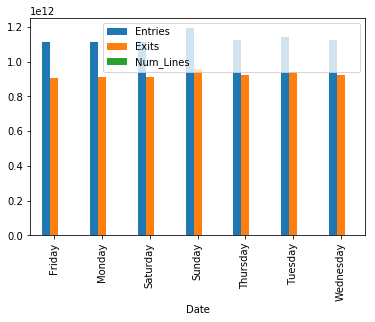
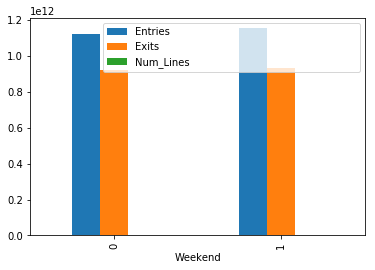

# Understanding Pandas Series and DataFrames - Lab

## Introduction

In this lab, let's get some hands on practice working with data cleanup using Pandas.

## Objectives
You will be able to:

* Manipulate columns in DataFrames (df.rename, df.drop)
* Manipulate the index in DataFrames (df.reindex, df.drop, df.rename)
* Manipulate column datatypes

## Let's get started!


```python
import pandas as pd
import matplotlib.pyplot as plt
%matplotlib inline
```


```python
df = pd.read_csv('turnstile_180901.txt')
print(len(df))
df.head()
```

    197625


<div>
<style scoped>
    .dataframe tbody tr th:only-of-type {
        vertical-align: middle;
    }

    .dataframe tbody tr th {
        vertical-align: top;
    }

    .dataframe thead th {
        text-align: right;
    }
</style>
<table border="1" class="dataframe">
  <thead>
    <tr style="text-align: right;">
      <th></th>
      <th>C/A</th>
      <th>UNIT</th>
      <th>SCP</th>
      <th>STATION</th>
      <th>LINENAME</th>
      <th>DIVISION</th>
      <th>DATE</th>
      <th>TIME</th>
      <th>DESC</th>
      <th>ENTRIES</th>
      <th>EXITS</th>
    </tr>
  </thead>
  <tbody>
    <tr>
      <th>0</th>
      <td>A002</td>
      <td>R051</td>
      <td>02-00-00</td>
      <td>59 ST</td>
      <td>NQR456W</td>
      <td>BMT</td>
      <td>08/25/2018</td>
      <td>00:00:00</td>
      <td>REGULAR</td>
      <td>6736067</td>
      <td>2283184</td>
    </tr>
    <tr>
      <th>1</th>
      <td>A002</td>
      <td>R051</td>
      <td>02-00-00</td>
      <td>59 ST</td>
      <td>NQR456W</td>
      <td>BMT</td>
      <td>08/25/2018</td>
      <td>04:00:00</td>
      <td>REGULAR</td>
      <td>6736087</td>
      <td>2283188</td>
    </tr>
    <tr>
      <th>2</th>
      <td>A002</td>
      <td>R051</td>
      <td>02-00-00</td>
      <td>59 ST</td>
      <td>NQR456W</td>
      <td>BMT</td>
      <td>08/25/2018</td>
      <td>08:00:00</td>
      <td>REGULAR</td>
      <td>6736105</td>
      <td>2283229</td>
    </tr>
    <tr>
      <th>3</th>
      <td>A002</td>
      <td>R051</td>
      <td>02-00-00</td>
      <td>59 ST</td>
      <td>NQR456W</td>
      <td>BMT</td>
      <td>08/25/2018</td>
      <td>12:00:00</td>
      <td>REGULAR</td>
      <td>6736180</td>
      <td>2283314</td>
    </tr>
    <tr>
      <th>4</th>
      <td>A002</td>
      <td>R051</td>
      <td>02-00-00</td>
      <td>59 ST</td>
      <td>NQR456W</td>
      <td>BMT</td>
      <td>08/25/2018</td>
      <td>16:00:00</td>
      <td>REGULAR</td>
      <td>6736349</td>
      <td>2283384</td>
    </tr>
  </tbody>
</table>
</div>


## Rename all the columns to lower case


```python
#Your code here
df.rename(str.lower, axis=1, inplace=True)
df.columns
```


    Index(['c/a', 'unit', 'scp', 'station', 'linename', 'division', 'date', 'time',
           'desc', 'entries',
           'exits                                                               '],
          dtype='object')


## Change the Index to be the Line Names


```python
#Your code here
df.set_index("linename", inplace=True)
df.head()
```


<div>
<style scoped>
    .dataframe tbody tr th:only-of-type {
        vertical-align: middle;
    }

    .dataframe tbody tr th {
        vertical-align: top;
    }

    .dataframe thead th {
        text-align: right;
    }
</style>
<table border="1" class="dataframe">
  <thead>
    <tr style="text-align: right;">
      <th></th>
      <th>c/a</th>
      <th>unit</th>
      <th>scp</th>
      <th>station</th>
      <th>division</th>
      <th>date</th>
      <th>time</th>
      <th>desc</th>
      <th>entries</th>
      <th>exits</th>
    </tr>
    <tr>
      <th>linename</th>
      <th></th>
      <th></th>
      <th></th>
      <th></th>
      <th></th>
      <th></th>
      <th></th>
      <th></th>
      <th></th>
      <th></th>
    </tr>
  </thead>
  <tbody>
    <tr>
      <th>NQR456W</th>
      <td>A002</td>
      <td>R051</td>
      <td>02-00-00</td>
      <td>59 ST</td>
      <td>BMT</td>
      <td>08/25/2018</td>
      <td>00:00:00</td>
      <td>REGULAR</td>
      <td>6736067</td>
      <td>2283184</td>
    </tr>
    <tr>
      <th>NQR456W</th>
      <td>A002</td>
      <td>R051</td>
      <td>02-00-00</td>
      <td>59 ST</td>
      <td>BMT</td>
      <td>08/25/2018</td>
      <td>04:00:00</td>
      <td>REGULAR</td>
      <td>6736087</td>
      <td>2283188</td>
    </tr>
    <tr>
      <th>NQR456W</th>
      <td>A002</td>
      <td>R051</td>
      <td>02-00-00</td>
      <td>59 ST</td>
      <td>BMT</td>
      <td>08/25/2018</td>
      <td>08:00:00</td>
      <td>REGULAR</td>
      <td>6736105</td>
      <td>2283229</td>
    </tr>
    <tr>
      <th>NQR456W</th>
      <td>A002</td>
      <td>R051</td>
      <td>02-00-00</td>
      <td>59 ST</td>
      <td>BMT</td>
      <td>08/25/2018</td>
      <td>12:00:00</td>
      <td>REGULAR</td>
      <td>6736180</td>
      <td>2283314</td>
    </tr>
    <tr>
      <th>NQR456W</th>
      <td>A002</td>
      <td>R051</td>
      <td>02-00-00</td>
      <td>59 ST</td>
      <td>BMT</td>
      <td>08/25/2018</td>
      <td>16:00:00</td>
      <td>REGULAR</td>
      <td>6736349</td>
      <td>2283384</td>
    </tr>
  </tbody>
</table>
</div>


# Change the index back


```python
# Your code here
df = df.reset_index()
df.head()
```


<div>
<style scoped>
    .dataframe tbody tr th:only-of-type {
        vertical-align: middle;
    }

    .dataframe tbody tr th {
        vertical-align: top;
    }

    .dataframe thead th {
        text-align: right;
    }
</style>
<table border="1" class="dataframe">
  <thead>
    <tr style="text-align: right;">
      <th></th>
      <th>linename</th>
      <th>c/a</th>
      <th>unit</th>
      <th>scp</th>
      <th>station</th>
      <th>division</th>
      <th>date</th>
      <th>time</th>
      <th>desc</th>
      <th>entries</th>
      <th>exits</th>
    </tr>
  </thead>
  <tbody>
    <tr>
      <th>0</th>
      <td>NQR456W</td>
      <td>A002</td>
      <td>R051</td>
      <td>02-00-00</td>
      <td>59 ST</td>
      <td>BMT</td>
      <td>08/25/2018</td>
      <td>00:00:00</td>
      <td>REGULAR</td>
      <td>6736067</td>
      <td>2283184</td>
    </tr>
    <tr>
      <th>1</th>
      <td>NQR456W</td>
      <td>A002</td>
      <td>R051</td>
      <td>02-00-00</td>
      <td>59 ST</td>
      <td>BMT</td>
      <td>08/25/2018</td>
      <td>04:00:00</td>
      <td>REGULAR</td>
      <td>6736087</td>
      <td>2283188</td>
    </tr>
    <tr>
      <th>2</th>
      <td>NQR456W</td>
      <td>A002</td>
      <td>R051</td>
      <td>02-00-00</td>
      <td>59 ST</td>
      <td>BMT</td>
      <td>08/25/2018</td>
      <td>08:00:00</td>
      <td>REGULAR</td>
      <td>6736105</td>
      <td>2283229</td>
    </tr>
    <tr>
      <th>3</th>
      <td>NQR456W</td>
      <td>A002</td>
      <td>R051</td>
      <td>02-00-00</td>
      <td>59 ST</td>
      <td>BMT</td>
      <td>08/25/2018</td>
      <td>12:00:00</td>
      <td>REGULAR</td>
      <td>6736180</td>
      <td>2283314</td>
    </tr>
    <tr>
      <th>4</th>
      <td>NQR456W</td>
      <td>A002</td>
      <td>R051</td>
      <td>02-00-00</td>
      <td>59 ST</td>
      <td>BMT</td>
      <td>08/25/2018</td>
      <td>16:00:00</td>
      <td>REGULAR</td>
      <td>6736349</td>
      <td>2283384</td>
    </tr>
  </tbody>
</table>
</div>


## Create another column 'Num_Lines' that is a count of how many lines pass through a station. Then sort your dataframe by this column in descending order
*Hint: According to the [data dictionary](http://web.mta.info/developers/resources/nyct/turnstile/ts_Field_Description.txt), LINENAME represents all train lines that can be boarded at a given station. Normally lines are represented by one character. For example, LINENAME 456NQR represents trains 4, 5, 6, N, Q, and R.*


```python
# Your code here
df["Num_Lines"] = df["linename"].apply(len)
df.head()
```


<div>
<style scoped>
    .dataframe tbody tr th:only-of-type {
        vertical-align: middle;
    }

    .dataframe tbody tr th {
        vertical-align: top;
    }

    .dataframe thead th {
        text-align: right;
    }
</style>
<table border="1" class="dataframe">
  <thead>
    <tr style="text-align: right;">
      <th></th>
      <th>linename</th>
      <th>c/a</th>
      <th>unit</th>
      <th>scp</th>
      <th>station</th>
      <th>division</th>
      <th>date</th>
      <th>time</th>
      <th>desc</th>
      <th>entries</th>
      <th>exits</th>
      <th>Num_Lines</th>
    </tr>
  </thead>
  <tbody>
    <tr>
      <th>0</th>
      <td>NQR456W</td>
      <td>A002</td>
      <td>R051</td>
      <td>02-00-00</td>
      <td>59 ST</td>
      <td>BMT</td>
      <td>08/25/2018</td>
      <td>00:00:00</td>
      <td>REGULAR</td>
      <td>6736067</td>
      <td>2283184</td>
      <td>7</td>
    </tr>
    <tr>
      <th>1</th>
      <td>NQR456W</td>
      <td>A002</td>
      <td>R051</td>
      <td>02-00-00</td>
      <td>59 ST</td>
      <td>BMT</td>
      <td>08/25/2018</td>
      <td>04:00:00</td>
      <td>REGULAR</td>
      <td>6736087</td>
      <td>2283188</td>
      <td>7</td>
    </tr>
    <tr>
      <th>2</th>
      <td>NQR456W</td>
      <td>A002</td>
      <td>R051</td>
      <td>02-00-00</td>
      <td>59 ST</td>
      <td>BMT</td>
      <td>08/25/2018</td>
      <td>08:00:00</td>
      <td>REGULAR</td>
      <td>6736105</td>
      <td>2283229</td>
      <td>7</td>
    </tr>
    <tr>
      <th>3</th>
      <td>NQR456W</td>
      <td>A002</td>
      <td>R051</td>
      <td>02-00-00</td>
      <td>59 ST</td>
      <td>BMT</td>
      <td>08/25/2018</td>
      <td>12:00:00</td>
      <td>REGULAR</td>
      <td>6736180</td>
      <td>2283314</td>
      <td>7</td>
    </tr>
    <tr>
      <th>4</th>
      <td>NQR456W</td>
      <td>A002</td>
      <td>R051</td>
      <td>02-00-00</td>
      <td>59 ST</td>
      <td>BMT</td>
      <td>08/25/2018</td>
      <td>16:00:00</td>
      <td>REGULAR</td>
      <td>6736349</td>
      <td>2283384</td>
      <td>7</td>
    </tr>
  </tbody>
</table>
</div>


## Write a function to clean a column name


```python
def clean(col_name):
    cleaned = col_name.title()
    return cleaned
```


```python
#This is a list comprehension. It applies your clean function to every item in the list.
#We then reassign that to df.columns
#You shouldn't have to change anything here.
#Your function above should work appropriately here.
df.columns = [clean(col) for col in df.columns] 
```


```python
#Checking the output, we can see the results.
df.columns
```


    Index(['Linename', 'C/A', 'Unit', 'Scp', 'Station', 'Division', 'Date', 'Time',
           'Desc', 'Entries',
           'Exits                                                               ',
           'Num_Lines'],
          dtype='object')


```python
# could also map a lambda function

df.columns = df.columns.map(lambda x: x.title())
df.columns
```


    Index(['Linename', 'C/A', 'Unit', 'Scp', 'Station', 'Division', 'Date', 'Time',
           'Desc', 'Entries',
           'Exits                                                               ',
           'Num_Lines'],
          dtype='object')


```python
# apply does not work on df.columns

df.columns.dtype
#df.columns = df.columns.apply(str.upper())
```


    dtype('O')


## Group the Data by Day of Week and Plot the Sum of The Numeric Columns


```python
#Your code here

# convert Date to Day of the Week:
#df["Date"] = pd.to_datetime(df["Date"])
#df["Date"] = df["Date"].dt.day_name()
sum_df = df.groupby(["Date"]).sum()
sum_df.plot.bar()
```


    <matplotlib.axes._subplots.AxesSubplot at 0x122b1c6d8>





## Group the Data by Weekend/Weekday and Plot the Sum of the Numeric Columns


```python
#Your code here
#sum_df["Weekend"] = sum_df.index.map({"Monday": 0, "Tuesday": 0, "Wednesday": 0, "Thursday": 0, "Friday": 0, "Saturday": 1, "Sunday": 1})
weekend_df = sum_df.groupby(["Weekend"]).mean()
weekend_df.plot.bar()
```


    <matplotlib.axes._subplots.AxesSubplot at 0x122bda240>





## Analysis Question: 

What is misleading about the day of week and weekend/weekday charts you just plotted?

  


```python
# Your answer here 
# Entries and Exits are summed without consideration of when each entry and each exit occurs. 
```

## Drop a couple of columns


```python
# Your code here
df.drop(["Unit", "Scp"], axis=1).head()
```


<div>
<style scoped>
    .dataframe tbody tr th:only-of-type {
        vertical-align: middle;
    }

    .dataframe tbody tr th {
        vertical-align: top;
    }

    .dataframe thead th {
        text-align: right;
    }
</style>
<table border="1" class="dataframe">
  <thead>
    <tr style="text-align: right;">
      <th></th>
      <th>Linename</th>
      <th>C/A</th>
      <th>Station</th>
      <th>Division</th>
      <th>Date</th>
      <th>Time</th>
      <th>Desc</th>
      <th>Entries</th>
      <th>Exits</th>
      <th>Num_Lines</th>
    </tr>
  </thead>
  <tbody>
    <tr>
      <th>0</th>
      <td>NQR456W</td>
      <td>A002</td>
      <td>59 ST</td>
      <td>BMT</td>
      <td>Saturday</td>
      <td>00:00:00</td>
      <td>REGULAR</td>
      <td>6736067</td>
      <td>2283184</td>
      <td>7</td>
    </tr>
    <tr>
      <th>1</th>
      <td>NQR456W</td>
      <td>A002</td>
      <td>59 ST</td>
      <td>BMT</td>
      <td>Saturday</td>
      <td>04:00:00</td>
      <td>REGULAR</td>
      <td>6736087</td>
      <td>2283188</td>
      <td>7</td>
    </tr>
    <tr>
      <th>2</th>
      <td>NQR456W</td>
      <td>A002</td>
      <td>59 ST</td>
      <td>BMT</td>
      <td>Saturday</td>
      <td>08:00:00</td>
      <td>REGULAR</td>
      <td>6736105</td>
      <td>2283229</td>
      <td>7</td>
    </tr>
    <tr>
      <th>3</th>
      <td>NQR456W</td>
      <td>A002</td>
      <td>59 ST</td>
      <td>BMT</td>
      <td>Saturday</td>
      <td>12:00:00</td>
      <td>REGULAR</td>
      <td>6736180</td>
      <td>2283314</td>
      <td>7</td>
    </tr>
    <tr>
      <th>4</th>
      <td>NQR456W</td>
      <td>A002</td>
      <td>59 ST</td>
      <td>BMT</td>
      <td>Saturday</td>
      <td>16:00:00</td>
      <td>REGULAR</td>
      <td>6736349</td>
      <td>2283384</td>
      <td>7</td>
    </tr>
  </tbody>
</table>
</div>


## Summary

Great! You practiced your data cleanup-skills using Pandas.
